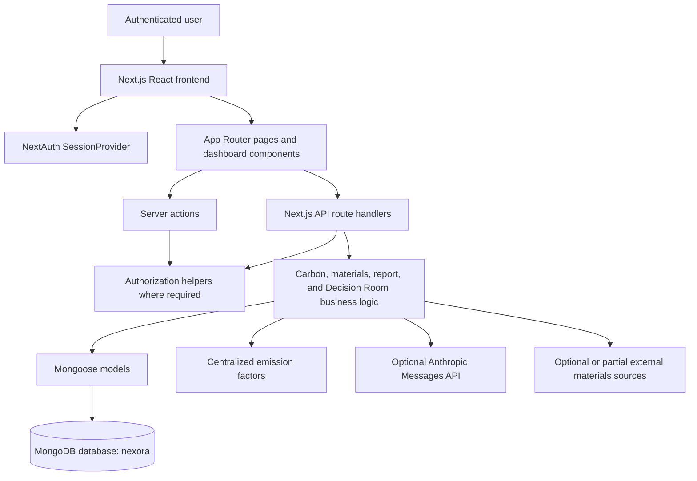

# JengaSafi

JengaSafi is a sustainability intelligence platform for Kenya's construction industry. It helps construction teams organize sites and projects, record carbon-related activities, track sustainability actions, review emissions and savings, ask context-grounded questions through Decision Room, and generate site-level sustainability reports.

## Overview

JengaSafi brings construction project information, environmental activity records, sustainability targets, and follow-up actions together in one application. Users can manage their construction sites and projects, record emissions and sustainability activities, monitor carbon performance, manage project actions, explore sustainable materials and suppliers, and download PDF reports.

The main workflow is:

```text
Account
  → Sustainability profile
  → Construction site
  → Project
  → Carbon activities and sustainability tasks
  → Emissions, savings, trends, and insights
  → Decision Room recommendations
  → PDF report
```

The application is built with Next.js, React, TypeScript, MongoDB, and Mongoose. It uses the Next.js App Router for the main application and API routes, alongside a small amount of legacy Pages Router/API code.

## Key Features

### User accounts and profiles

- Sign up with a name, email address, and password.
- Sign in through NextAuth credentials authentication.
- Store passwords as bcrypt hashes.
- Maintain a sustainability profile containing:
  - company
  - role
  - sustainability goals
  - reduction target
  - focus areas
  - setup completion state

### Construction sites and projects

- Create and list user-owned construction sites.
- Record site location, project type, size, dates, budget, and status.
- Create projects linked to an owned site.
- Store project descriptions, locations, dates, and ownership.

### Carbon activity tracking

Carbon activities can represent emissions or savings-related records, including:

- energy
- transport
- machinery
- waste
- water
- renewable energy
- sustainable materials
- recycling
- water reuse

Activities store values, descriptions, site ownership, optional fuel types, and optional standard and sustainable emission factors.

### Emissions and savings calculations

JengaSafi uses centralized deterministic emission factors and calculation utilities to calculate:

- activity emissions
- activity savings
- total emissions
- total savings
- net emissions
- completed-task savings
- efficiency scores
- reduction progress against a baseline and target

The factors are defined in `lib/emissionFactors.ts` as application constants rather than being fetched from a live factor provider.

### Sustainability targets, trends, and forecasts

Carbon data supports:

- baseline emissions
- reduction targets
- target emissions
- reduction progress
- progress percentage
- emissions by category
- monthly data
- carbon-data status

The carbon trends endpoint calculates a trend series and a basic forecast using `lib/forecast.ts`. The forecast uses linear regression, generates six future points, advances in daily increments, sets forecast savings to `0`, and clamps negative forecast values to `0`.

### Tasks and EcoTasks

`Task` and `EcoTask` are separate schemas and API concepts:

- `Task` represents project tasks with priority, impact, status, due date, assignment, and estimated or actual carbon reduction. Its statuses are `todo`, `in-progress`, and `done`.
- `EcoTask` represents sustainability-oriented project tasks with materials, deadlines, ecological impact, assignment, and estimated or actual carbon savings. Its statuses are `pending`, `in-progress`, and `completed`.

Decision Room recommendations can be converted into project `Task` records through the dashboard. The two task systems are related in purpose but use different database models, fields, status values, and API behavior.

### Sustainability insights

The `/api/insights` route and related insight components provide deterministic carbon insights from recorded activities. Current rules consider renewable-energy percentage, transport fuel usage, waste generation, and water usage.

These insights are generated by application logic in `lib/carbonInsights.ts`; they are not generated by an LLM. The current dashboard does not establish a dedicated Insights tab.

### Materials and suppliers

JengaSafi provides:

- a sustainable-material catalog
- supplier records
- supplier-to-material references
- material categories, prices, units, availability, and ecological attributes
- supplier location, rating, certifications, and specialties
- a materials listing route whose GET handler does not require `requireAuth()`
- an admin-authorized materials creation route
- a suppliers listing route whose GET handler does not require `requireAuth()`

Sustainable materials are currently catalog-level records. The material schema does not contain a project foreign key, so Decision Room material context can include catalog-wide materials rather than only materials associated with the selected project.

JengaSafi also provides optional or partial external materials-source routes. Their availability and configuration requirements are described in [External Materials Sources](#external-materials-sources).

### Dashboard

The authenticated dashboard provides tabs for:

- Overview
- Projects
- EcoTasks
- Decision Room
- Carbon Intelligence

The dashboard fetches profile, project, site, and task data in parallel. It also provides a first-run profile modal when a sustainability profile has not yet been created.

### Decision Room

Decision Room is an optional Anthropic-backed feature available through `/api/decision-room`.

It:

- loads the authenticated user's authorized site, project, profile, carbon activity, material, and open-task context
- calculates deterministic carbon metrics for that context
- sends the supplied project context and user question to the Anthropic Messages API
- requires a structured JSON response
- validates the response with Zod
- displays recommendations, reasoning, evidence, tradeoffs, constraints, uncertainties, and proposed next steps
- allows a proposed next step to be added to project tasks

The prompt instructs the provider to use evidence and provenance categories such as recorded project data, deterministic calculation, external estimate, and AI reasoning. The internal context builder and model-output schema use related but not identical terminology for some provenance labels; these should be understood as an application-defined evidence classification contract.

`ANTHROPIC_API_KEY` is required to use Decision Room, but it is not required merely to start the rest of the application. `ANTHROPIC_MODEL` can override the route's default model name.

### PDF reports

Authenticated users can generate and download a PDF report for a selected construction site. Reports include, where available:

- site and project information
- reporting metadata
- total emissions
- total carbon savings
- net emissions
- efficiency score
- recorded carbon activities
- emissions breakdown
- carbon insights
- EcoTasks
- data-provenance notes

Reports are generated server-side with `pdf-lib` and returned as PDF downloads. The current report form selects a site but does not expose a date-range filter; the generated report covers the site's currently stored records.

## How It Works

1. A user creates an account at `/signup`.
2. The user signs in at `/login` using email and password.
3. The protected dashboard checks for a sustainability profile.
4. The user completes or updates their sustainability profile.
5. The user creates a construction site.
6. The user creates one or more projects linked to that site.
7. The user records carbon activities and manages project or EcoTask actions.
8. Carbon routes calculate emissions, savings, net values, progress, trends, and forecasts.
9. The Insights API and related components provide deterministic recommendations from recorded carbon activity.
10. Decision Room analyzes authorized project context using the configured Anthropic provider.
11. The Reports page at `/dashboard/reports` generates a downloadable PDF for a selected site.

## Architecture



The primary request path is:

```text
Browser → Next.js page/component → API route or server action
       → authentication/authorization where implemented
       → business logic and Mongoose model
       → MongoDB
```

## Technology Stack

| Technology | Version or source | Purpose |
| --- | --- | --- |
| Next.js | `^16.3.3` | Application framework, App Router, route handlers, and rendering |
| React | `19.2.3` | User interface |
| TypeScript | `^5` | Type-safe application code |
| MongoDB | Driver `^6.12.0` installed; database used through Mongoose | Persistent data store |
| Mongoose | `^8.9.5` | Active MongoDB connection, schemas, models, and queries |
| NextAuth | `^4.24.11` | Credentials authentication and JWT sessions |
| bcryptjs | `^2.4.3` | Password hashing and verification |
| Tailwind CSS | `^3.4.1` | Styling |
| Framer Motion | `^12.23.22` | UI animation |
| Recharts | `^3.2.1` installed dependency | Charting and data-visualization dependency; usage should be verified per component |
| Zod | `^4.1.11` | Decision Room request and response validation |
| pdf-lib | `^1.17.1` | Server-side PDF report generation |
| Leaflet / React Leaflet | `^1.9.4` / `^5.0.0` installed dependencies | Map-related packages |
| Google Maps packages | See `package.json` | Installed Google Maps-related dependencies; not every package is established as an active production integration |
| SWR | `^2.3.6` installed dependency | Data-fetching utilities and dependency |
| dotenv | `^16.4.7` | Loading `.env.local` in database-related code and scripts |
| patch-package | `^8.0.0` | Applying the checked-in React Water Wave patch after installation |

JengaSafi also has installed dependencies for Clerk, GitLab, EmailJS, Nodemailer, mapping, and other UI utilities. An installed package is not necessarily an active production integration.

## Project Structure

```text
.
├── @types/                       Custom TypeScript declarations
├── actions/                      Server actions, including signup
├── app/
│   ├── api/                      App Router API route handlers
│   ├── dashboard/                Authenticated dashboard pages and components
│   │   └── reports/               Report-generation page
│   ├── login/                    Login page
│   ├── models/                   Mongoose models
│   ├── signup/                   Signup page
│   ├── layout.tsx                Root layout, fonts, providers, and global effects
│   ├── page.tsx                  Public landing page
│   └── providers.tsx             NextAuth SessionProvider
├── components/                   Shared UI and visual components
├── data/                         Static application data
├── hooks/                        Client-side hooks
├── lib/
│   ├── auth.ts                   NextAuth configuration
│   ├── authorization.ts          Authentication and authorization helpers
│   ├── carbonCalculation.ts      Carbon calculations and efficiency scoring
│   ├── carbonInsights.ts         Deterministic carbon insights
│   ├── db.ts                     Cached Mongoose connection
│   ├── emissions.ts              Emission-factor access
│   ├── emissionFactors.ts        Centralized emission-factor constants
│   ├── forecast.ts               Carbon trend forecasting utility
│   ├── materials/                Material services and types
│   └── decision-room/             Decision Room context, prompts, and schemas
├── middleware.ts                 Dashboard/admin route protection
├── mongodb-atlas/                MongoDB Atlas trigger code
├── pages/api/                    Legacy Pages Router API handlers
├── patches/                      Checked-in dependency patches
├── public/                       Static assets, fonts, and images
├── scripts/                      Seed and material-seeding scripts
├── sections/                     Landing-page sections
├── types/                        Shared domain types
├── utils/                        Supporting utilities and ingestion scripts
├── next.config.ts                Next.js configuration
├── package.json                  Scripts and dependencies
├── tailwind.config.ts            Tailwind configuration
└── tsconfig.json                 TypeScript configuration and `@/*` alias
```

## Authentication & Authorization

Authentication is implemented with NextAuth's `CredentialsProvider`.

- Users authenticate with email and password.
- `lib/auth.ts` loads the user from MongoDB and verifies the password with `bcrypt.compare`.
- New passwords are hashed with `bcrypt.hash` in `actions/signup.ts`.
- Sessions use the JWT strategy.
- The JWT stores the user ID, name, email, and role.
- The session exposes those values as `session.user`.
- Supported application roles are `user` and `admin`.
- `requireAuth()` rejects unauthenticated or structurally invalid sessions.
- `requireRole("admin")` protects admin-only operations such as material creation.
- `middleware.ts` redirects unauthenticated requests for `/dashboard` and `/admin` to `/login`.
- Admin users requesting `/dashboard` are redirected to `/admin`; non-admin users requesting `/admin` are redirected to `/dashboard`.

The application retains a legacy login action that returns HTTP 410 and directs callers to NextAuth credentials sign-in instead.

Authorization is not identical across every route. In particular, the GET handlers for `/api/materials` and `/api/suppliers`, and the `/api/proxy-2050-materials` route, do not call `requireAuth()`.

## Data & Database

JengaSafi connects to MongoDB using Mongoose. `lib/db.ts` loads `MONGODB_URI` and connects to the `nexora` database name. The connection is cached globally for reuse during development and server execution.

Important models include:

| Model | Purpose | Main relationships |
| --- | --- | --- |
| `User` | Account credentials and role | Owns profile and user-scoped records through email/user ID fields |
| `SustainabilityProfile` | User sustainability goals and focus areas | Associated with a user; referenced optionally by sites |
| `Site` | Construction site context | Belongs to a user; can contain projects and carbon data |
| `Project` | Project within a site | References `Site` through `siteId`; belongs to a user |
| `CarbonActivity` | Recorded emissions or savings activity | Scoped by `userId` and `siteId` |
| `CarbonData` | Site baseline, target, progress, categories, and monthly data | References `Site` through `siteId` |
| `Task` | Project action/task | References a project through `projectId` |
| `EcoTask` | Sustainability-oriented project task | References `Project` through `projectId` |
| `Supplier` | Supplier catalog record | Referenced by sustainable materials |
| `SustainableMaterial` | Sustainable material catalog entry | References `Supplier` through `supplier`; has no project foreign key |
| `Report` | Report-related model present in the application | The active PDF generator reads site/project/activity/task data directly rather than relying on this model |

Ownership is normally enforced by querying records with the authenticated user's email. The application uses string email ownership in several models and ObjectId references for site and project relationships.

## Carbon & Sustainability Intelligence

### Activity types

`CarbonActivity` accepts the activity types defined in `types/CarbonActivity.ts`:

- energy
- renewable
- transport
- machinery
- material
- waste
- recycling
- water
- water reuse

### Deterministic calculations

`lib/carbonCalculation.ts` calculates values using centralized factors from `lib/emissionFactors.ts`:

- grid energy: `0.43`
- diesel energy: `2.68`
- transport: `0.12`
- diesel fuel: `2.68`
- landfill waste: `1.90`
- water: `0.34`
- standard material factor: `800`
- sustainable material factor: `350`

These are application constants. JengaSafi does not currently provide a live factor-verification or carbon-certification workflow for them.

### Targets and progress

For a site with a baseline and reduction target, JengaSafi can calculate:

- required reduction
- progress percentage
- remaining reduction
- target emissions
- reduction progress

The carbon trends route combines activity savings with actual carbon reductions recorded on completed project tasks when those records are available.

### Forecasts and insights

- `lib/forecast.ts` generates a basic linear-regression forecast from trend data.
- The forecast produces six future points using daily increments.
- Forecast savings are currently `0`.
- Negative forecast values are clamped to `0`.
- `lib/carbonInsights.ts` generates deterministic text insights based on activity thresholds and renewable-energy share.
- `/api/insights` returns those insights for an authenticated user and site.

These calculations and insights should not be interpreted as independently verified carbon accounting or certification.

### Decision Room AI

Decision Room is the explicitly external LLM-backed feature in JengaSafi. `/api/decision-room` calls the Anthropic Messages API with:

- an authenticated user's authorized site and project context
- recorded activities, catalog materials, open tasks, and sustainability target data
- deterministic carbon metrics
- a strict JSON response contract validated with Zod

The response schema supports evidence categories for recorded project data, deterministic calculations, external estimates, and AI reasoning. The internal context builder uses its own recorded/calculated source metadata, while the prompt and output schema define the model-facing categories. Recommendations and next steps are proposals; the provider is instructed not to modify project records.

## API

The main API route groups are:

| Route group | Purpose |
| --- | --- |
| `/api/auth/[...nextauth]` | NextAuth sign-in and session endpoints |
| `/api/profile` | Read, create, and update the authenticated user's sustainability profile |
| `/api/sites` | List and create owned construction sites |
| `/api/locations` | Location data and location statistics |
| `/api/projects` | List and create projects linked to owned sites |
| `/api/tasks` | List and create project tasks, with filtering by project, status, and priority |
| `/api/tasks/[id]` | Get, update, or delete an authorized project task |
| `/api/ecotasks` | List and create sustainability EcoTasks |
| `/api/ecotasks/[id]` | Update an authorized EcoTask |
| `/api/carbon` | Read legacy/global carbon summary data from the latest global `Carbon` record |
| `/api/carbon-data/initialize` | Initialize site carbon data |
| `/api/carbon-data/set-baseline` | Set a site's server-calculated carbon baseline |
| `/api/carbon-trends` | Return user/site-scoped activities, emissions, savings, progress, trends, and forecasts |
| `/api/carbon-trends/new` | Create a validated `CarbonActivity` for an owned site |
| `/api/recalculate-metrics` | Recalculate carbon-related metrics |
| `/api/activities` | List the authenticated user's carbon activities |
| `/api/insights` | Return deterministic carbon insights |
| `/api/decision-room` | Generate validated, context-grounded Anthropic recommendations |
| `/api/reports/generate` | Generate and download a PDF report |
| `/api/materials` | List materials through GET without `requireAuth()`; admins can create materials |
| `/api/materials/external` | Authenticated proxy for selected external materials sources |
| `/api/proxy-2050-materials` | Optional 2050 Materials API proxy; this route does not call `requireAuth()` |
| `/api/suppliers` | List suppliers through GET without `requireAuth()` |
| `/api/kenya-materials` | Kenya-material catalog route |
| `/api/dashboard` | Legacy dashboard API handler |
| `/api/gamification` | Gamification-related API route |
| `/api/kpis` | KPI-related API route |
| `/api/reports` | Reports-related API route group |

Routes are implementation-oriented rather than a stable public API. Request validation and authorization vary by route, so callers should inspect the relevant handler before integrating with them.

## Reports

The Reports page is available at `/dashboard/reports`. It:

1. Loads the user's sites and projects.
2. Loads carbon trend data for the selected site.
3. Shows a browser-side preview of emissions, savings, net emissions, activity counts, and efficiency score.
4. Calls `POST /api/reports/generate`.
5. Downloads the returned PDF in the browser.

The server-side report generator verifies site and optional project ownership, loads recorded activities and related project/EcoTask data, applies the existing calculation utilities, and creates a multi-section PDF with `pdf-lib`.

## External Materials Sources

JengaSafi provides an authenticated `/api/materials/external` proxy supporting these source names:

- `epc`
- `usgs`
- `openfoodfacts`
- `openlca`

These are optional or partial integrations rather than uniformly available production services:

- EPC requires `EPC_API_USERNAME` and `EPC_API_PASSWORD`.
- OpenLCA requires `OPENLCA_API_KEY`.
- USGS currently returns an unavailable response because the legacy products API is no longer available.
- Open Food Facts is called without an application credential in the current route.

JengaSafi also provides a `/api/proxy-2050-materials` route using `MATERIALS_2050_API_KEY`. When that key is absent or the upstream service is unavailable, the route returns an empty materials list.

## Setup & Installation

### Prerequisites

- Node.js with npm.
- A MongoDB deployment reachable from the development environment.
- A MongoDB database user with permission to access the configured database.
- An authentication secret for NextAuth.
- An Anthropic API key only if Decision Room is required.

The project does not specify a Node.js version in `package.json`, so use a Node.js version compatible with the listed Next.js, React, and TypeScript dependencies.

### Clone and install

```bash
git clone https://github.com/Onunga123/jengasafi-local.git
cd jengasafi-local
npm install
```

`npm install` runs the `postinstall` script, which applies the checked-in patch through `patch-package`.

### Configure environment variables

Create a local `.env.local` file in the project root. At minimum, configure:

```env
MONGODB_URI=mongodb+srv://<username>:<password>@<cluster>/<database>
NEXTAUTH_SECRET=<long-random-secret>
```

For Decision Room use only:

```env
ANTHROPIC_API_KEY=<anthropic-api-key>
# Optional; the route defaults to its configured model name when omitted.
ANTHROPIC_MODEL=<anthropic-model-name>
```

See [Environment Variables](#environment-variables) for optional materials-source configuration.

### Start development

```bash
npm run dev
```

The development script runs `nodemon --exec next dev`.

### Build and run production mode

```bash
npm run build
npm run start
```

### Seed data

```bash
npm run seed
```

`scripts/seed.ts` is a legacy/demo seed script. It loads `.env.local`, connects to MongoDB, clears several collections, and inserts sample sites, KPIs, alerts, carbon data, and NEMA data. Review it carefully before running it against any shared or production database.

## Environment Variables

| Variable | Required? | Purpose |
| --- | --- | --- |
| `MONGODB_URI` | Required | MongoDB connection URI. The application connects to the `nexora` database name in `lib/db.ts`. |
| `NEXTAUTH_SECRET` | Required for correct secure NextAuth operation | Secret read by NextAuth for JWT/session signing. |
| `ANTHROPIC_API_KEY` | Required only to use Decision Room | API key for the Anthropic Messages API; not required merely to start the rest of the application. |
| `ANTHROPIC_MODEL` | Optional | Overrides the Decision Room model name; the route supplies a default when omitted. |
| `EPC_API_USERNAME` | Optional, required for EPC source | EPC external materials-source credentials. |
| `EPC_API_PASSWORD` | Optional, required for EPC source | EPC external materials-source credentials. |
| `OPENLCA_API_KEY` | Optional, required for OpenLCA source | OpenLCA external materials-source credential. |
| `MATERIALS_2050_API_KEY` | Optional | Enables the 2050 Materials proxy route; without it or when the upstream is unavailable, that route returns an empty list. |

`.env*` files are ignored through `.gitignore`. Never commit credentials or secrets.

## Development

Available package scripts:

| Command | Description |
| --- | --- |
| `npm run dev` | Start the Next.js development server through Nodemon |
| `npm run build` | Create a production build |
| `npm run start` | Start the production server after a build |
| `npm run lint` | Run the configured Next.js lint command |
| `npm run seed` | Run the legacy/destructive demo seed script |

The application uses the `@/*` TypeScript path alias, mapped to the project root. Most server-side routes explicitly call `connectDB()` and then use `requireAuth()` or `requireRole()` before accessing protected data, but authorization should be checked route by route.

## Security Considerations

JengaSafi currently includes:

- bcrypt password hashing and verification
- NextAuth credentials authentication
- JWT-based sessions
- `user` and `admin` roles
- middleware protection for dashboard and admin paths
- server-side authorization helpers
- ownership checks in many site, project, task, carbon-data, report, and Decision Room operations
- environment-based storage of database, authentication, AI, and external-service credentials
- Zod validation of Decision Room model output before it is returned to the client

The application includes legacy and transitional routes that should be reviewed before being exposed as public integrations. In particular, `/api/materials` GET, `/api/suppliers` GET, and `/api/proxy-2050-materials` are not protected by `requireAuth()`.

## Known Limitations / Project Status

JengaSafi is an active project with several important technical limitations:

- The application uses both modern App Router handlers and legacy Pages Router/API code.
- Some installed dependencies appear unused, transitional, or experimental, including Clerk, GitLab-related packages, multiple mapping packages, and legacy utilities. Installed packages should not automatically be interpreted as active production integrations.
- The application has more than one carbon-data approach: a site/user-scoped `CarbonData` model and a legacy/global `Carbon` model used by `/api/carbon` and the seed script.
- `/api/carbon` reads the latest global `Carbon` record and does not provide the same user/site-scoped behavior as the newer carbon activity APIs.
- Ownership conventions are not completely uniform: several records use the authenticated user's email as a string owner identifier, while site and project relationships use MongoDB ObjectIds.
- `Task` and `EcoTask` are separate schemas with different status conventions and API behavior.
- Sustainable materials are catalog-level records without a project foreign key. Decision Room material context can therefore include catalog-wide materials.
- `scripts/seed.ts` defines legacy demo collections and clears data; it should not be treated as a safe production migration.
- External materials-source availability is not uniform. USGS is explicitly unavailable, EPC and OpenLCA require credentials, and the 2050 Materials proxy can return an empty list when unconfigured or unavailable.
- `/api/materials` GET is not protected by `requireAuth()`.
- `/api/suppliers` GET is not protected by `requireAuth()`.
- `/api/proxy-2050-materials` is not protected by `requireAuth()`.
- Emission factors are stored as application constants; JengaSafi does not currently provide a live factor-verification or carbon-certification workflow.
- Forecasting uses basic linear regression, six future points, daily increments, zero forecast savings, and non-negative clamping. It is not an advanced forecasting or machine-learning system.
- Decision Room depends on an external Anthropic API and can fail because of provider configuration, rate limits, timeouts, invalid JSON, or invalid response contracts. It should not be treated as a replacement for professional environmental or engineering advice.
- The report generator currently reports all stored activity for the selected site; the UI does not provide a date-range selector.
- JengaSafi should not be considered production-ready, independently certified for carbon accounting, or compliant with a particular regulatory framework.

## Contributing

Contributions should preserve the application's authentication, ownership checks, data relationships, and calculation behavior. Before opening a pull request:

1. Review the affected route handlers, models, and client components together.
2. Keep secrets out of source control.
3. Run the relevant local checks, including the build or lint command where applicable.
4. Document changes to API behavior, data models, environment variables, and carbon calculations.

No separate contribution policy is currently defined for the project.

## License

The project includes the following copyright and licensing notice in `LICENSE`:

> Copyright (c) 2026 JENGASAFI. All Rights Reserved.

The notice states that the repository and its contents are the exclusive property of JENGASAFI and its authors, and that copying, distribution, forking, modification, or use requires express written permission from the copyright owner. 
This README does not assign an additional license or permissions beyond the text in `LICENSE`.
