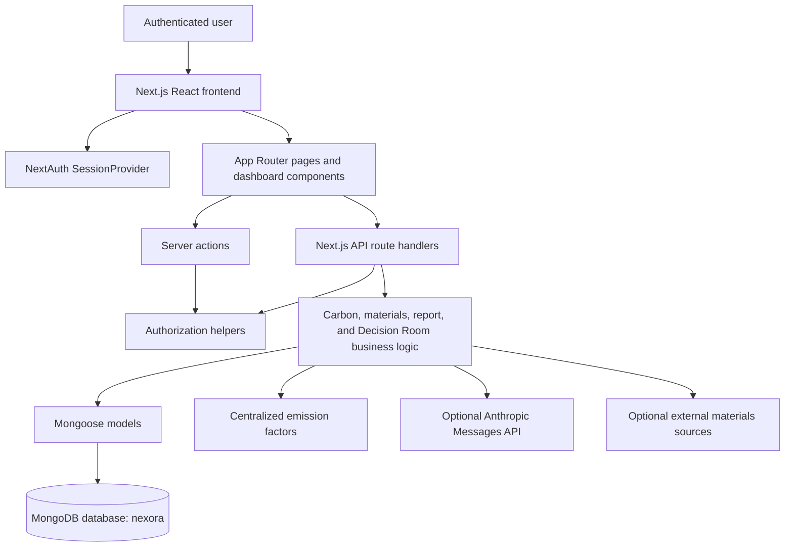

# JengaSafi

JengaSafi is a Next.js sustainability intelligence platform for construction projects. It helps authenticated users organize construction sites and projects, record carbon-related activities, track sustainability actions, review emissions and savings, use grounded Decision Room recommendations, and generate PDF sustainability reports.

The repository describes JengaSafi as a platform for Kenya's construction industry. The current implementation combines project records, deterministic carbon calculations, sustainability targets, material and supplier catalogs, task management, and an optional Anthropic-powered Decision Room.

## Overview

Construction teams often need to bring project information, environmental activity records, sustainability targets, and follow-up actions together in one place. JengaSafi provides an authenticated dashboard for doing that at site and project level.

The implemented workflow is centered on:

```text
Account
  → Sustainability profile
  → Construction site
  → Project
  → Carbon activities and sustainability tasks
  → Emissions, savings, trends, and insights
  → Decision Room recommendations
  → PDF report
```

The application is implemented as a full-stack Next.js application backed by MongoDB and Mongoose. It includes both App Router route handlers under `app/api` and a small amount of legacy Pages Router code.

## Key Features

### User accounts and profiles

- Sign up with a name, email address, and password.
- Log in through NextAuth credentials authentication.
- Store passwords as bcrypt hashes.
- Maintain a sustainability profile containing:
  - company
  - role
  - sustainability goals
  - reduction target
  - focus areas
  - setup completion state

### Construction sites and projects

- Create and list authenticated users' construction sites.
- Record site location, project type, size, dates, budget, and status.
- Create projects linked to an owned site.
- Store project descriptions, locations, dates, and ownership.

### Carbon activity tracking

Carbon activities can represent emissions or savings-related records, including:

- energy
- transport
- machinery
- waste
- water
- renewable energy
- sustainable materials
- recycling
- water reuse

Activities store values, descriptions, site ownership, optional fuel types, and optional standard/sustainable emission factors.

### Emissions and savings calculations

The application uses centralized deterministic emission factors and calculation utilities. It calculates:

- activity emissions
- activity savings
- total emissions
- total savings
- net emissions
- completed-task savings
- efficiency scores
- reduction progress against a baseline and target

Current factors are defined in `lib/emissionFactors.ts`. They are application constants, not fetched from a live factor provider.

### Sustainability targets and trends

Carbon data supports:

- baseline emissions
- reduction targets
- target emissions
- reduction progress
- progress percentage
- emissions by category
- monthly data
- site status

The carbon trends endpoint also calculates a trend series and a forecast using the repository's forecasting utility.

### Tasks and EcoTasks

The application contains two related task concepts:

- `Task`: project tasks with priority, impact, status, due date, assignment, and estimated/actual carbon reduction.
- `EcoTask`: sustainability-oriented project tasks with materials, deadlines, ecological impact, assignment, and estimated/actual carbon savings.

Decision Room recommendations can be converted into project `Task` records through the dashboard.

### Sustainability insights

The `/api/insights` route produces rule-based carbon insights from recorded activities. Current rules consider factors such as:

- renewable energy percentage
- transport fuel usage
- waste generation
- water usage

These insights are generated by application logic in `lib/carbonInsights.ts`; they are not generated by an LLM.

### Materials and suppliers

The repository includes:

- a sustainable-material catalog
- supplier records
- supplier-to-material references
- material categories, prices, units, availability, and ecological attributes
- supplier location, rating, certifications, and specialties
- an authenticated materials listing endpoint
- an admin-only materials creation endpoint
- an authenticated suppliers listing endpoint

The repository also contains external materials-source routes for selected upstream services. These integrations are optional and have source-specific configuration and availability limitations; see [External materials sources](#external-materials-sources).

### Dashboard

The authenticated dashboard provides tabs for:

- Overview
- Projects
- EcoTasks
- Decision Room
- Carbon Intelligence

The dashboard fetches profile, project, site, and task data in parallel. It also provides a first-run profile modal when a sustainability profile has not yet been created.

### Decision Room

Decision Room is an optional AI-assisted feature available through `/api/decision-room`.

It:

- loads authorized site, project, profile, carbon activity, material, and open-task context
- calculates deterministic carbon metrics for that context
- sends the grounded context and user question to the Anthropic Messages API
- requires a structured JSON response
- validates the response with Zod
- displays recommendations, reasoning, evidence, tradeoffs, constraints, uncertainties, and proposed next steps
- allows a proposed next step to be added to project tasks

The Decision Room prompt explicitly instructs the provider not to invent project facts or modify JengaSafi records. The feature requires `ANTHROPIC_API_KEY` and defaults to the model name configured in the route.

### PDF reports

Authenticated users can generate and download a PDF report for a selected construction site. Reports include, where available:

- site and project information
- reporting metadata
- total emissions
- total carbon savings
- net emissions
- efficiency score
- recorded carbon activities
- emissions breakdown
- carbon insights
- EcoTasks
- data-provenance notes

Reports are generated server-side with `pdf-lib` and returned as PDF downloads. The current report form selects a site but does not expose a date-range filter; the generated report covers the site's currently stored records.

## How It Works

1. A user creates an account at `/signup`.
2. The user signs in at `/login` using email and password.
3. The protected dashboard checks for a sustainability profile.
4. The user completes or updates their sustainability profile.
5. The user creates a construction site.
6. The user creates one or more projects linked to that site.
7. The user records carbon activities and manages project or EcoTask actions.
8. Carbon routes calculate emissions, savings, net values, progress, trends, and forecasts.
9. The Insights view provides deterministic recommendations from recorded carbon activity.
10. The Decision Room can analyze authorized project context using the configured Anthropic provider.
11. The Reports page generates a downloadable PDF for a selected site.

## Architecture



The primary request path is:

```text
Browser → Next.js page/component → API route or server action
       → requireAuth()/requireRole()
       → business logic and Mongoose model
       → MongoDB
```

## Technology Stack

| Technology | Version or source | Purpose |
| --- | --- | --- |
| Next.js | `^16.3.3` | Application framework, App Router, route handlers, server rendering |
| React | `19.2.3` | User interface |
| TypeScript | `^5` | Type-safe application code |
| MongoDB | Driver `^6.12.0` | Persistent data store |
| Mongoose | `^8.9.5` | MongoDB schemas, models, and queries |
| NextAuth | `^4.24.11` | Credentials authentication and JWT sessions |
| bcryptjs | `^2.4.3` | Password hashing and verification |
| Tailwind CSS | `^3.4.1` | Styling |
| Framer Motion | `^12.23.22` | UI animation |
| Recharts | `^3.2.1` | Charts and data visualization dependency |
| Zod | `^4.1.11` | Decision Room request/response validation |
| pdf-lib | `^1.17.1` | Server-side PDF report generation |
| Leaflet / React Leaflet | `^1.9.4` / `^5.0.0` | Map-related UI dependencies |
| Google Maps packages | See `package.json` | Google Maps-related UI dependencies |
| SWR | `^2.3.6` | Data-fetching dependency used by repository utilities |
| dotenv | `^16.4.7` | Loading `.env.local` for database-related scripts and code |
| patch-package | `^8.0.0` | Applying the checked-in React Water Wave patch after installation |

## Project Structure

```text
.
├── @types/                       Custom TypeScript declarations
├── actions/                      Server actions, including signup
├── app/
│   ├── api/                      App Router API route handlers
│   ├── dashboard/                Authenticated dashboard pages and components
│   ├── login/                    Login page
│   ├── models/                   Mongoose models
│   ├── reports/                  Report-related UI routes
│   ├── signup/                   Signup page
│   ├── layout.tsx                Root layout, fonts, providers, and global effects
│   ├── page.tsx                  Public landing page
│   └── providers.tsx             NextAuth SessionProvider
├── components/                   Shared UI and visual components
├── data/                         Static application data
├── hooks/                        Client-side hooks
├── lib/
│   ├── auth.ts                   NextAuth configuration
│   ├── authorization.ts           Authentication/authorization helpers
│   ├── carbonCalculation.ts       Carbon calculations and efficiency scoring
│   ├── carbonInsights.ts          Deterministic carbon insights
│   ├── db.ts                      Cached Mongoose connection
│   ├── emissions.ts               Emission-factor access
│   ├── emissionFactors.ts         Centralized emission-factor constants
│   ├── forecast.ts                Carbon trend forecasting utility
│   ├── materials/                 Material services and types
│   └── decision-room/             Decision Room context, prompts, and schemas
├── middleware.ts                  Dashboard/admin route protection
├── mongodb-atlas/                 MongoDB Atlas trigger code
├── pages/api/                     Legacy Pages Router API handlers
├── patches/                       Checked-in dependency patches
├── public/                        Static assets, fonts, and images
├── scripts/                       Seed and material-seeding scripts
├── sections/                      Landing-page sections
├── types/                         Shared domain types
├── utils/                         Supporting utilities and ingestion scripts
├── next.config.ts                 Next.js configuration
├── package.json                   Scripts and dependencies
├── tailwind.config.ts             Tailwind configuration
└── tsconfig.json                  TypeScript configuration and `@/*` alias
```

## Authentication & Authorization

Authentication is implemented with NextAuth's `CredentialsProvider`.

- Users authenticate with email and password.
- `lib/auth.ts` loads the user from MongoDB and verifies the password with `bcrypt.compare`.
- New passwords are hashed with `bcrypt.hash` in `actions/signup.ts`.
- Sessions use the JWT strategy.
- The JWT stores the user ID, name, email, and role.
- The session exposes those values as `session.user`.
- Supported application roles are `user` and `admin`.
- `requireAuth()` rejects unauthenticated or structurally invalid sessions.
- `requireRole("admin")` protects admin-only operations such as material creation.
- `middleware.ts` redirects unauthenticated requests for `/dashboard` and `/admin` to `/login`.
- Admin users requesting `/dashboard` are redirected to `/admin`; non-admin users requesting `/admin` are redirected to `/dashboard`.

The repository contains a legacy login action that returns HTTP 410 and directs callers to use NextAuth credentials sign-in instead.

## Data & Database

The application connects to MongoDB using Mongoose. `lib/db.ts` loads `MONGODB_URI` and connects to the `nexora` database name. The connection is cached globally for reuse during development and server execution.

Important models include:

| Model | Purpose | Main relationships |
| --- | --- | --- |
| `User` | Account credentials and role | Owns profile and user-scoped records through email/user ID fields |
| `SustainabilityProfile` | User sustainability goals and focus areas | Associated with a user; referenced optionally by sites |
| `Site` | Construction site context | Belongs to a user; can contain projects and carbon data |
| `Project` | Project within a site | References `Site` through `siteId`; belongs to a user |
| `CarbonActivity` | Recorded emissions or savings activity | Scoped by `userId` and `siteId` |
| `CarbonData` | Site baseline, target, progress, categories, and monthly data | References `Site` through `siteId` |
| `Task` | Project action/task | References a project through `projectId` |
| `EcoTask` | Sustainability-oriented project task | References `Project` through `projectId` |
| `Supplier` | Supplier catalog record | Referenced by sustainable materials |
| `SustainableMaterial` | Sustainable material catalog entry | References `Supplier` through `supplier` |
| `Report` and related report code | Report-domain structures | Report generation currently reads site/project/activity/task data into a PDF |

Ownership is normally enforced by querying records with the authenticated user's email. The codebase uses string email ownership in several models and ObjectId references for site/project relationships.

## Carbon & Sustainability Intelligence

### Activity types

`CarbonActivity` accepts the activity types defined in `types/CarbonActivity.ts`. The calculation utilities support emissions activities such as energy, transport, machinery, waste, and water, and savings activities such as renewable energy, sustainable materials, recycling, and water reuse.

### Deterministic calculations

`lib/carbonCalculation.ts` calculates values using centralized factors from `lib/emissionFactors.ts`:

- grid energy: `0.43`
- diesel energy: `2.68`
- transport: `0.12`
- diesel fuel: `2.68`
- landfill waste: `1.90`
- water: `0.34`
- standard material factor: `800`
- sustainable material factor: `350`

The repository treats these as application constants. The code does not demonstrate a live authoritative-factor API.

### Targets and progress

For a site with a baseline and reduction target, the application can calculate:

- required reduction
- progress percentage
- remaining reduction
- target emissions
- reduction progress

The carbon trends route combines activity savings with actual carbon reductions recorded on completed project tasks when those records are available.

### Forecasts and insights

- `lib/forecast.ts` generates forecasts from trend data.
- `lib/carbonInsights.ts` generates deterministic text insights based on activity thresholds and renewable-energy share.
- `/api/insights` returns those insights for an authenticated user and site.

These calculations and insights should not be interpreted as independently verified carbon accounting or certification.

### Decision Room AI

The Decision Room is the one explicitly external LLM-backed feature in the current codebase. `/api/decision-room` calls the Anthropic Messages API with:

- an authenticated user's authorized site and project context
- recorded activities, materials, open tasks, and sustainability target data
- deterministic carbon metrics
- a strict JSON response contract validated with Zod

The response distinguishes recorded project data, deterministic calculations, external estimates, and AI reasoning. Recommendations and next steps are proposals; the provider is instructed not to modify project records. The application itself creates a task only when the user explicitly chooses to add a returned next step through the dashboard.

## API

The main API route groups are:

| Route group | Purpose |
| --- | --- |
| `/api/auth/[...nextauth]` | NextAuth sign-in and session endpoints |
| `/api/profile` | Read, create, and update the authenticated user's sustainability profile |
| `/api/sites` | List and create owned construction sites |
| `/api/locations` | Location data and location statistics |
| `/api/projects` | List and create projects linked to owned sites |
| `/api/tasks` | List and create project tasks, with filtering by project, status, and priority |
| `/api/tasks/[id]` | Task-specific operations |
| `/api/ecotasks` | List and create sustainability EcoTasks |
| `/api/ecotasks/[id]` | EcoTask-specific operations |
| `/api/carbon` | Read legacy/global carbon summary data |
| `/api/carbon-data/initialize` | Initialize site carbon data |
| `/api/carbon-data/set-baseline` | Set a site's carbon baseline |
| `/api/carbon-trends` | Return activities, emissions, savings, progress, trends, and forecasts |
| `/api/carbon-trends/new` | Additional carbon-trend creation route |
| `/api/recalculate-metrics` | Recalculate carbon-related metrics |
| `/api/activities` | Carbon activity operations |
| `/api/insights` | Return deterministic carbon insights |
| `/api/decision-room` | Generate validated, context-grounded AI recommendations |
| `/api/reports/generate` | Generate and download a PDF report |
| `/api/materials` | List materials; admins can create materials |
| `/api/materials/external` | Proxy selected external materials sources |
| `/api/proxy-2050-materials` | Optional 2050 Materials API proxy |
| `/api/suppliers` | List suppliers |
| `/api/kenya-materials` | Kenya-material catalog route |
| `/api/dashboard` | Legacy dashboard API handler |
| `/api/gamification` | Gamification-related API route |
| `/api/kpis` | KPI-related API route |
| `/api/reports` | Reports-related API route group |

Routes should be treated as implementation-oriented rather than a stable public API. Request validation and authorization vary by route, so callers should inspect the relevant handler before integrating with it.

## Reports

The Reports page is available under the authenticated dashboard route structure. It:

1. Loads the user's sites and projects.
2. Loads carbon trend data for the selected site.
3. Shows a browser-side preview of emissions, savings, net emissions, activity counts, and efficiency score.
4. Calls `POST /api/reports/generate`.
5. Downloads the returned PDF in the browser.

The server-side report generator verifies site and optional project ownership, loads recorded activities and related project/EcoTask data, applies the existing calculation utilities, and creates a multi-section PDF with `pdf-lib`.

## External Materials Sources

The repository includes an authenticated `/api/materials/external` proxy supporting source names used by the implementation:

- `epc`
- `usgs`
- `openfoodfacts`
- `openlca`

The current behavior is source-specific:

- EPC requires `EPC_API_USERNAME` and `EPC_API_PASSWORD`.
- OpenLCA requires `OPENLCA_API_KEY`.
- USGS currently returns an unavailable response because the legacy products API is no longer available.
- Open Food Facts is called without an application credential in the current route.

There is also a `/api/proxy-2050-materials` route using `MATERIALS_2050_API_KEY`; when that key is absent or the upstream request fails, the route returns an empty materials list.

## Setup & Installation

### Prerequisites

- Node.js with npm.
- A MongoDB deployment reachable from the development environment.
- A MongoDB database user with permission to access the configured database.
- An authentication secret for NextAuth.
- An Anthropic API key if the Decision Room is required.

The repository does not specify a Node.js version in `package.json`, so use a Node.js version compatible with the listed Next.js, React, and TypeScript dependencies.

### Clone and install

```bash
git clone https://github.com/Onunga123/jengasafi-local.git
cd jengasafi-local
npm install
```

`npm install` runs the repository's `postinstall` script, which applies the checked-in patch through `patch-package`.

### Configure environment variables

Create a local `.env.local` file in the repository root. At minimum, configure:

```env
MONGODB_URI=mongodb+srv://<username>:<password>@<cluster>/<database>
NEXTAUTH_SECRET=<long-random-secret>
```

For Decision Room:

```env
ANTHROPIC_API_KEY=<anthropic-api-key>
# Optional; the route defaults to its configured model name when omitted.
ANTHROPIC_MODEL=<anthropic-model-name>
```

See [Environment Variables](#environment-variables) for optional materials-source configuration.

### Start development

```bash
npm run dev
```

The development script runs `nodemon --exec next dev`.

### Build and run production mode

```bash
npm run build
npm run start
```

### Seed data

The repository includes:

```bash
npm run seed
```

The current `scripts/seed.ts` is a legacy/demo seed script. It loads `.env.local`, connects to MongoDB, clears several collections, and inserts sample sites, KPIs, alerts, carbon data, and NEMA data. Review the script carefully before running it against any shared or production database.

## Environment Variables

| Variable | Required? | Purpose |
| --- | --- | --- |
| `MONGODB_URI` | Required | MongoDB connection URI. The application connects to the `nexora` database name in `lib/db.ts`. |
| `NEXTAUTH_SECRET` | Required for secure NextAuth operation | Secret used by NextAuth for JWT/session signing. |
| `ANTHROPIC_API_KEY` | Required only for Decision Room | API key for the Anthropic Messages API. |
| `ANTHROPIC_MODEL` | Optional | Overrides the Decision Room model name; the route supplies a default when omitted. |
| `EPC_API_USERNAME` | Optional, required for EPC source | EPC external materials-source credentials. |
| `EPC_API_PASSWORD` | Optional, required for EPC source | EPC external materials-source credentials. |
| `OPENLCA_API_KEY` | Optional, required for OpenLCA source | OpenLCA external materials-source credential. |
| `MATERIALS_2050_API_KEY` | Optional | Enables the 2050 Materials proxy route; without it, that route returns an empty list. |

The repository ignores `.env*` files through `.gitignore`. Never commit credentials or secrets.

## Development

Available package scripts:

| Command | Description |
| --- | --- |
| `npm run dev` | Start the Next.js development server through Nodemon |
| `npm run build` | Create a production build |
| `npm run start` | Start the production server after a build |
| `npm run lint` | Run the configured Next.js lint command |
| `npm run seed` | Run the legacy/destructive demo seed script |

The application uses the `@/*` TypeScript path alias, mapped to the repository root. Most server-side routes explicitly call `connectDB()` and then use `requireAuth()` or `requireRole()` before accessing protected data.

## Security Considerations

The current implementation includes:

- bcrypt password hashing and verification
- NextAuth credentials authentication
- JWT-based sessions
- role values of `user` and `admin`
- middleware protection for dashboard and admin paths
- server-side authorization helpers
- ownership checks for sites, projects, tasks, carbon data, reports, and Decision Room context
- environment-based storage of database, authentication, AI, and external-service credentials
- Zod validation of Decision Room model output before it is returned to the client

The repository also contains legacy and transitional routes. Review each route's authorization behavior before exposing it as a public integration.

## Known Limitations / Project Status

The codebase is an active project with several important maintenance considerations:

- The repository does not currently contain a root `README.md`; this document is being added as project documentation.
- The codebase contains both modern App Router handlers and legacy Pages Router/API code.
- Some dependencies appear unused, transitional, or experimental, including Clerk, GitLab-related packages, multiple mapping packages, and some legacy utilities.
- The repository has more than one carbon-data approach: a site/user-scoped `CarbonData` model and a legacy/global `Carbon` model used by `/api/carbon` and the seed script.
- Ownership conventions are not completely uniform: several records use the authenticated user's email as a string owner identifier, while site/project relationships use MongoDB ObjectIds.
- The current `scripts/seed.ts` defines legacy demo collections and clears data; it should not be treated as a safe production migration.
- External material-source availability is not uniform. The USGS source is explicitly unavailable in the current implementation, and other sources require credentials or may return upstream errors.
- Deterministic emission factors are stored in source code. The repository does not implement a live verification or certification workflow for those factors.
- The Decision Room depends on an external Anthropic API, can fail because of provider configuration, rate limits, timeouts, invalid JSON, or invalid response contracts, and should not be treated as a replacement for professional environmental or engineering advice.
- The report generator currently reports all stored activity for the selected site; the UI does not provide a date-range selector.
- The repository does not establish production-readiness, independent carbon-accounting certification, or compliance with a particular regulatory framework.

## Contributing

Contributions should preserve the application's existing authentication, ownership checks, data relationships, and calculation behavior. Before opening a pull request:

1. Review the affected route handlers, models, and client components together.
2. Keep secrets out of source control.
3. Run the relevant local checks, including the build or lint command where applicable.
4. Document changes to API behavior, data models, environment variables, and carbon calculations.

No separate contribution policy is currently defined in the repository.

## License

The repository includes a proprietary copyright notice in `LICENSE`.

Copyright (c) 2025 JENGASAFI (Wamalwa Jeff Michael). All rights reserved. The license text states that the repository and its contents may not be copied, distributed, forked, modified, or used without express written permission from the copyright owner. Permission requests are directed to `andikamichael163@gmail.com`.

This project should therefore not be treated as an open-source project under a permissive license.
